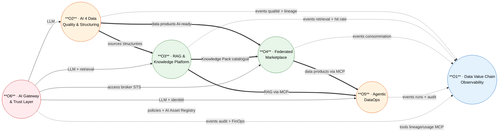

# Résumé de l'étude — Vision Data 2030

**Auteur :** Bassim El Baroudi — Architecte technique Data & IA
**Date :** 10 juin 2026
**Statut :** Synthèse transverse — V1.0
**Objet :** Document de synthèse qui résume l'ensemble de l'étude « Contribution technique à la Vision Data 2030 » : cadre stratégique, architecture cible, portefeuille des six offres, roadmap, budget, arbitrages et risques.
**Documents source :** `01-synthese-strategy-day.md`, `02-dossier-architecture-data2030.md`, `03-…version-humaine.md`, `04-cartographie-offres-data2030.md`, `07-arbitrages-et-roadmap.md`, dossiers `offre-1` à `offre-6`.

---

## 1. En bref (résumé exécutif)

Cette étude propose une **contribution technique structurée à la Vision Data 2030 du Groupe**, élaborée à partir des conclusions de la Strategy Day (équipes A3I / PA3I). Elle part d'une thèse simple :

> **La donnée est devenue le facteur limitant de l'IA d'entreprise.** Tant que la plateforme Data n'intègre pas l'IA *comme matériau de production* — et non plus seulement comme consommatrice — aucune des promesses de la Vision Data 2030 (companions, agents, conformité *by design*, mutualisation Groupe) ne tient à l'échelle.

La réponse prend la forme d'un **portefeuille de six offres de services techniques** qui forment **une plateforme cohérente**, pas un catalogue de briques indépendantes :

| # | Offre | Rôle |
|---|---|---|
| **1** | Data Value Chain Observability | **Socle** — rend visible et mesurable la chaîne de valeur de la data (lineage, usage, valeur) |
| **2** | AI 4 Data Quality & Structuring | Fabrique la matière *AI-ready* (qualité, classification, structuration de l'unstructured) |
| **3** | Enterprise RAG & Knowledge Platform | RAG-as-a-Service Groupe gouverné ; moteur du futur *AI Compliance Companion* |
| **4** | Federated Data Marketplace | Marketplace fédérée de data products (interne + partenaires, *clean rooms*) |
| **5** | Agentic DataOps Platform | Agents IA encadrés pour automatiser les opérations data |
| **6** | AI Gateway & Trust Layer | **Socle** — point de passage obligé de tout appel IA (routing, redaction, audit, FinOps, AI Act) |

**Chiffres clés du programme :**
- **Horizon :** 24 mois (12 mois pour la *GA* des socles, 18 mois pour les KPI cibles, 24 mois pour la bascule build→run).
- **Budget build :** **28–40 FTE** sur 12 mois (forte mutualisation). **Équipe run :** ~15–18 FTE.
- **Démarrage recommandé :** les deux socles **Offre 1 + Offre 6** en pilotes dès le T0, sur **2 entités volontaires**.

**Décision attendue :** valider les **6 arbitrages stratégiques (S1–S6)** qui conditionnent le lancement (voir §9). Posture assumée de l'auteur : *« mieux vaut ne pas démarrer que démarrer sans ces validations »*, le risque d'échec d'adoption contaminerait toutes les offres.

---

## 2. Contexte et objectif

- **Cadre :** la **Strategy Day** a réuni les équipes A3I et PA3I pour converger sur les besoins clients, synthétisés en **quatre thèmes stratégiques**.
- **Auteur / destinataire :** dossier technique porté par l'architecte Data & IA, adressé au **manager N+2 / CTO** pour validation et arbitrage.
- **But :** proposer une **vision purement technique** — un ensemble d'offres de services qui renforcent la plateforme Data en s'appuyant massivement sur l'IA générative et agentique.

**Les quatre thèmes de la Strategy Day :**

| Thème | Slogan | Traduction technique dans l'étude |
|---|---|---|
| **1. Capacités IA** | *Scale AI impact on employee efficiency* | Companions, AgentaaS, AI expertise, STTaaS |
| **2. Data** | *Unlock end-to-end Data value* | Chaîne de valeur ingestion → … → usage → mesure (Offres 1, 2, 4) |
| **3. Gouvernance & Risque IA** | *Trusted and compliant AI by design* | Trust Layer, Compliance Pack, AI assessment (Offres 6, 3) |
| **4. Adoption & accessibilité** | *Easy to access, understand, adopt, scale* | Marketplace, économie transparente, FinOps (Offres 4, 6) |

**Fil rouge :** *industrialiser* ce qui marche, *mutualiser* au niveau Groupe, *embarquer la conformité dès la conception*.

---

## 3. Thèse centrale et principes directeurs (P1–P7)

L'architecture repose sur sept principes invariants, cités par toutes les offres :

| # | Principe | En une phrase |
|---|---|---|
| **P1** | **Data-as-a-Product** | Chaque exposition est un produit : owner, SLA, versioning, contrat de schéma, métadonnées de qualité et de conformité. |
| **P2** | **AI-native by design** | Toute couche expose des hooks pour des modèles ; tout artefact IA est tracé comme un asset. |
| **P3** | **Federated, not centralized** | Mesh logique : les entités gardent l'ownership des données ; le Groupe fournit le plan de contrôle et les standards. |
| **P4** | **Compliance & observability by design** | AI Act, lineage, FinOps, RGPD intégrés au plan de contrôle, pas en couche tierce. |
| **P5** | **Open standards first** | OpenLineage, Iceberg, Arrow, OpenTelemetry, MCP, OpenAPI, A2A — pas de lock-in propriétaire sur les couches structurantes. |
| **P6** | **Composable, low-code accessible** | Capacités exposées en API + UI low-code pour ouvrir aux équipes métier. |
| **P7** | **GPU-aware FinOps** | Toute capacité IA embarque sa logique de coût (tokens, GPU-h, embeddings) et la remonte au plan de contrôle. |

---

## 4. Architecture cible

### 4.1 Trois plans logiques (la clé de la posture fédérée)

| Plan | Rôle | Localisation | Métaphore (réseau ferroviaire) |
|---|---|---|---|
| **Plan de données** (*data plane*) | Exécuter le travail (stockage, compute, pipelines, GPU) | **Distribué chez les entités** | Les trains et les voies |
| **Plan de contrôle** (*control plane*) | Savoir : cataloguer, tracer, observer (métadonnées uniquement) | **Mutualisé Groupe** | Le centre de régulation |
| **Plan de confiance** (*trust plane*) | Autoriser, prouver : sécurité, conformité, FinOps, audit | **Mutualisé Groupe**, sur le chemin chaud | Douane, billetterie, contrôle de sécurité |

**Principe financier associé :** le **plan de contrôle/confiance** est financé en CapEx mutualisé Groupe ; le **plan de données** est refacturé à l'usage (FinOps). C'est ce qui aligne les incitations et rend la gouvernance obligatoire.

**Réponse à la question « déploiements isolés vs mutualisation » :** une entité peut garder son data plane isolé (souveraineté, GPU privés) tout en se branchant au plan de contrôle/confiance Groupe via des connecteurs minimaux. Elle gagne la mutualisation (gouvernance, observabilité, qualité) sans renoncer à ses contraintes locales.

### 4.2 Six couches (de bas en haut)

`Plan de contrôle` (catalog, lineage, quality, AI registry, observability) → `Stockage` (lakehouse Iceberg, vector store, object, graph) → `Traitement` (pipelines, AI 4 Data, label factory, MLOps) → `Exposition` (marketplace, RAG endpoints, feature store, APIs) → `Confiance & gateway` (AI gateway, policy engine, audit, FinOps) → `Consommation` (companions, agents, BI, apps, partenaires).

### 4.3 Standards d'interconnexion structurants

OpenLineage + OpenTelemetry (observation), **Data Contracts** versionnés (publication), Iceberg REST (stockage fédéré), **MCP** (outils pour agents), OIDC + **SPIFFE/SPIRE** (identités humains/workloads), OPA/Cedar (policy-as-code).

---

## 5. Le portefeuille des six offres

> Chaque offre est détaillée dans son propre dossier (`offre-N-*.md`) et suit la même trame : pitch CTO, produit concret, architecture, technos, phases, FinOps/SLO, risques. Ci-dessous la version condensée.

### Offre 1 — Data Value Chain Observability *(socle)*
- **Métaphore :** *le GPS Waze de la data du Groupe*.
- **Problème :** personne ne sait *qui consomme une table*, *quelle est sa valeur métier réelle*, *sur quelles données un companion a halluciné*.
- **Cœur :** lineage technique + sémantique end-to-end, intégrant les **consommateurs IA comme citoyens de première classe** ; *value heatmap* (coût vs réutilisation) ; alertes santé.
- **Stack :** Memgraph (graphe), ClickHouse (time-series), Redpanda (bus), OpenLineage + Protobuf, Apollo/FastAPI, React + Cytoscape.js.
- **KPI 18 mois :** couverture lineage **80 %**, réutilisation médiane **> 3** consommateurs/data product, *time-to-discover* **< 1 j**.
- **Pourquoi socle :** alimente toutes les autres offres en lineage et télémétrie — sans elle, rien n'est mesurable.

### Offre 2 — AI 4 Data Quality & Structuring
- **Métaphore :** *une raffinerie* (coût marginal qui baisse avec le volume).
- **Problème :** 70–80 % de la valeur informationnelle est dans l'*unstructured* (contrats, mails, scans) inaccessible à l'IA ; les tables structurées ne sont pas *AI-ready*.
- **Cœur :** qualité augmentée par LLM (assertions, anomalies sémantiques), classification (PII, criticité, AI Act), structuration (OCR + extraction LLM typée + *citation matching* anti-hallucination), Label Factory.
- **Stack :** Kafka + Schema Registry, Great Expectations + dbt-checks, PaddleOCR + Azure Document Intelligence (OCR *tiered*), Pydantic strict, Argilla, MLflow.
- **KPI 18 mois :** **60 %** de data products *AI-ready*, temps de structuration **÷ 5**, précision d'extraction **≥ 92 %**, coût **< 5 €/1 000 docs**.

### Offre 3 — Enterprise RAG & Knowledge Platform
- **Métaphore :** *une bibliothèque municipale gérée par des bibliothécaires professionnels*.
- **Problème :** chaque équipe bricole son RAG (hallucinations, fuites d'ACL, zéro évaluation continue).
- **Cœur :** ingestion versionnée, chunking sémantique, embeddings multi-modèles avec **cache persistant** (30–50 % d'économie), *hybrid search* (BM25 + vectoriel + RRF), reranking, **ACL propagées au niveau du chunk**, golden sets + évaluation continue (blocage de release). **Knowledge Packs** dont le **Compliance Pack** stratégique (moteur du *AI Compliance Companion*).
- **Stack :** LlamaIndex (lib) + service custom, e5-mistral/text-embedding-3/Cohere, pgvector → Qdrant, BGE-reranker-v2, RAGAS + DeepEval, vLLM, Langfuse + OTel, serveur MCP.
- **KPI 18 mois :** *hit@5* **≥ 80 %**, hallucination **≤ 3 %**, latence p95 **< 300 ms**, **≥ 5 Knowledge Packs** vivants.

### Offre 4 — Federated Data Marketplace
- **Métaphore :** *une bourse régulée* (la bourse n'est pas propriétaire des actifs).
- **Problème :** le partage cross-entités se fait par mails et exports désynchronisés, sans contrat, facture ni audit ; l'ouverture partenaires est artisanale.
- **Posture clé :** **le Groupe est plan de contrôle, jamais data plane** — il détient contrats, métadonnées, grants et events, jamais les données brutes ni les clés des entités.
- **Cœur :** catalogue fédéré, **Data Contracts** (ODCS v3 + extensions), Access Broker (tokens STS courts, OPA), Billing event-driven (chargeback), *federated query* (Trino), **clean rooms** (PETs : hashing, differential privacy, TEE), discovery sémantique via Knowledge Pack.
- **Stack :** Iceberg + Polaris/Nessie, Trino, OPA, Kafka + Flink + Postgres (billing), Confidential Containers/Nitro Enclaves, serveur MCP, Next.js + shadcn/ui.
- **KPI 18 mois :** **30** data products certifiés, réutilisation cross-entité **≥ 30 %**, *time-to-contract* **< 5 j**, **> 1 Md** lignes scannées cross-entité/mois.

### Offre 5 — Agentic DataOps Platform
- **Métaphore :** *un atelier industriel avec des apprentis encadrés par des maîtres* (l'autonomie se gagne, elle ne se présume pas).
- **Problème :** les data engineers passent trop de temps sur des tâches répétitives mais mesurables (investigation qualité, migrations de schéma, audit AI Act, FinOps).
- **Cœur :** catalogue d'agents (data-quality-bot, schema-evolution-bot, ingestion-bot, FinOps-bot, model-card-bot, AI-Act-bot), runtime sandboxé avec **identité SPIFFE par run**, **niveaux d'autonomie L1→L4** (promotion lente et documentée, kill-switch immédiat), **human-in-the-loop strict**, budgets (tokens/temps/appels), audit immuable.
- **Stack :** LangGraph + Pydantic, Kubernetes + operator custom, SPIFFE/SPIRE, MCP, OPA/Cedar, immudb, OTel GenAI + Langfuse.
- **KPI 18 mois :** **6 agents** en production (dont **≥ 2 en L2/L3**), *time saved* ≥ baseline ROI, couverture audit **100 %**.
- **Articulation :** instance Data spécialisée de l'**AgentaaS Groupe**.

### Offre 6 — AI Gateway & Trust Layer *(socle)*
- **Métaphore :** *un poste de douane d'aéroport pour l'IA*.
- **Problème :** chaque équipe appelle l'IA en direct, sans audit, sans redaction PII, sans identité opposable pour les agents, sans contrôle des coûts ni conformité AI Act.
- **Cœur :** point de passage **obligatoire** ; routing multi-modèles, *input/output guards* (PII, secrets, prompt injection), policy engine (OPA, bundles signés), **AI Asset Registry** + classification AI Act, **audit immuable**, FinOps streaming, **Trust Certification**. Adoption triviale (changement de `base_url`, drop-in OpenAI-compat).
- **Stack :** Envoy + router Go (façon LiteLLM), OPA, Presidio + DeBERTa custom, LLM Guard, MLflow + registre custom, immudb + TSA + S3 WORM, Kafka + ClickHouse, OTel GenAI, Next.js + GraphQL.
- **KPI 12 mois :** **100 %** du trafic IA via la gateway, redaction PII **≥ 99 %**, couverture registre **≥ 90 %**, **100 assets Trust Certified**, MTTR policy **< 1 h**, **SLO latence ajoutée p95 < 50 ms** (non négociable), premier audit externe sans finding critique.
- **Pourquoi socle :** prérequis non négociable de la conformité et des companions Groupe.

---

## 6. Comment les offres s'articulent

Les six offres forment **un système**, structuré par **deux socles transverses** (1 et 6) et **quatre familles de flux** : production de valeur, plan de confiance, observation, gouvernance.

### 6.1 Schéma d'ensemble (Mermaid)



| Trait | Famille de flux | Sens |
|---|---|---|
| `══>` épais | **Production de valeur** | O2 fabrique la matière → O3/O4 exposent → O5 consomme |
| `──>` plein | **Plan de confiance** | O6 sur le chemin chaud de tout appel LLM (proxy, identité, access broker) |
| `-.->` pointillé | **Observation** | toutes les offres émettent leur télémétrie vers O1 (asynchrone, bus) |
| `~~~` lien | **Gouvernance** | O1 et O6 outillent O5 (tools lineage, policies, AI Asset Registry) |

### 6.2 Même schéma en ASCII (lecture hors rendu Mermaid)

```
                        ┌─────────────────────────────────────────┐
                        │   O6 · AI GATEWAY & TRUST LAYER          │   ← plan de confiance
                        │   (proxy LLM · identité · access broker) │      (chemin chaud)
                        └─────────────────────────────────────────┘
                          │ LLM      │ LLM+ret. │ LLM+id.  │ STS broker
                          ▼          ▼          ▼          ▼
        ┌──────────────┐  ┌──────────────┐  ┌──────────────┐  ┌───────────────┐
   ════>│ O2 · AI 4    │═>│ O3 · RAG &   │═>│ O5 · Agentic │<═│ O4 · Federated│
   data │ DATA Quality │  │ KNOWLEDGE    │  │ DATAOPS      │  │ MARKETPLACE   │
   prod │ & Structuring│  │ PLATFORM     │  │ (agents)     │  │               │
        └──────┬───────┘  └──────┬───────┘  └──────┬───────┘  └──────┬────────┘
               │ data products AI-ready (O2→O4) ═══════════════════►│
               │ Knowledge Pack catalogué (O3→O4) ═════════════════►│
               │          │                  ▲  data products/RAG via MCP
               │          │                  │  (O4→O5, O3→O5)
   events ┄┄┄┄┄┼┄┄┄┄┄┄┄┄┄┄┼┄┄┄┄┄┄┄┄┄┄┄┄┄┄┄┄┄┄┘  + events O4, O6 ┄┄┄┐
   qualité     ▼          ▼                                        ▼
        ┌────────────────────────────────────────────────────────────┐
        │   O1 · DATA VALUE CHAIN OBSERVABILITY                       │ ← plan de contrôle
        │   (reçoit toute la télémétrie · expose tools lineage/usage) │   (carrefour)
        └────────────────────────────────────────────────────────────┘
                          │ tools lineage/usage (MCP) ──► O5
   Légende :  ═══> production de valeur   ──► confiance / LLM
              ┄┄┄> observation (events)   tools/policies ──► gouvernance
```

- **Densités d'interaction :** Offre 1 est le **carrefour** de télémétrie (10 liens), Offre 5 le plus gros **consommateur** (7 liens), Offre 6 l'**os central** sur le chemin chaud (6 liens).
- **Conséquence :** un déploiement en silo ferait perdre l'essentiel de la valeur. **Chaîne critique :** Offre 6 (Q1) est requise avant O2/O3/O4/O5 ; Offre 1 (Q1) avant les outils MCP de O5.

---

## 7. Roadmap consolidée (24 mois)

**Principes de phasage :** socles d'abord ; cadrage *vertical* par offre (périmètre minimal) ; *gates* trimestriels mesurables et publics ; **traiter le risque politique avant le risque technique** (O4 et O5 cadrées politiquement au Q1).

| Trimestre | Cap | Faits marquants |
|---|---|---|
| **Q1** (M1-3) | Fondations socles | O1 + O6 en pilotes (2 entités, mode shadow), **charte de gouvernance signée** |
| **Q2** (M4-6) | Démarrage offres productives | O2, O3, O4 v1 ; lineage IA ; policy engine + AI Asset Registry |
| **Q3** (M7-9) | Compliance Pack + agentique | **Compliance Pack publié** ; O5 (2 agents L1) ; Access Broker + Billing |
| **Q4** (M10-12) | Industrialisation + GA socles | **GA O1 + O6**, Trust Certification, exposition externe pilote, AI-Act-bot, **pen-test externe** |
| **Q5** (M13-15) | Extension + clean rooms + A2A | Clean rooms multi-partenaires, orchestration multi-agents (A2A) |
| **Q6** (M16-18) | Consolidation | **Atteinte des KPI cibles 18 mois** |
| **Q7-Q8** (M19-24) | Capitalisation | V2, bascule vers ~15 FTE run |

**5 jalons critiques (observables) :** **J1** charte signée (T+3) → **J2** première mesure de valeur (T+6) → **J3** Compliance Pack (T+9) → **J4** GA des socles + pen-test (T+12) → **J5** KPI 18 mois atteints (T+18).

---

## 8. Budget et équipe

| Phase | FTE pic | Note |
|---|---|---|
| Q1 | **10** | Équipe socle (O1 + O6) |
| Q2 | 22 | Démarrage offres productives |
| Q3 | 30 | + agentique |
| **Q4** | **35** | **Pic du programme** |
| Q5 → Q6 | 32 → 28 | Redescente |
| Q7-Q8 | 20 → **15** | Bascule build → run |

- **Total build (12 mois) :** **28–40 FTE**, sous condition de **forte mutualisation** (SRE, FinOps, sécurité comptés une fois).
- **Run annualisé :** **15–18 FTE**.
- **Leviers FinOps structurants :** FinOps *enforced* dès le jour 1 via la Gateway (« pas de budget déclaré = pas d'appel »), GPU mutualisé Groupe à quotas, *tiering* de modèles (facteur ~20 sur le coût LLM), OCR *tiered* (facteur ~30), cache d'embeddings partagé (30–50 % d'économie).

---

## 9. Arbitrages clés à valider

### 9.1 Six arbitrages stratégiques — COMEX, validation immédiate (S1–S6)

| # | Arbitrage | Reco | Enjeu si non validé |
|---|---|---|---|
| **S1** | Inversion stratégique : la donnée = matériau de production de l'IA | OUI | Programme sans fondement |
| **S2** | Prioriser O1 + O6 en pilotes dès maintenant | OUI | Rien n'est mesurable ni défendable |
| **S3** | Tenir la posture *fédérée, jamais centralisée* | OUI | Rejet par les entités |
| **S4** | Engager les fonctions Groupe (RSSI, DPO, légal) dès Q1 | OUI | Compliance Pack + Trust Cert impossibles |
| **S5** | Sécuriser l'enveloppe build (28–40 FTE) | OUI | Livraison dégradée/retardée |
| **S6** | Identifier 2 entités-pilotes volontaires | À faire | +6 mois de friction de négociation |

### 9.2 Autres familles d'arbitrages (détaillées dans `07-arbitrages-et-roadmap.md`)

- **Politiques/organisationnels (8) :** charte Marketplace, engagement écrit « agents ≠ objectif d'effectif », comité de gouvernance des agents, Trust Certification Board, formation Rego pour compliance officers, plafonnement volontaire d'autonomie (ex. AI-Act-bot ≤ L2).
- **Financiers/FinOps (8) :** CapEx mutualisé vs OpEx refacturé, pricing Marketplace à somme nulle 6 mois, FinOps *enforced* via Gateway, GPU mutualisé, *tiering* modèles, cache d'embeddings, budget pen-test externe O6.
- **Techniques (26) :** choix de stack par offre (Memgraph, Redpanda, ClickHouse, Polaris, Iceberg, Trino, ODCS, OPA, LangGraph, SPIFFE, immudb, Envoy, Presidio, Argilla, pgvector→Qdrant…), tous tracés pour les migrations V1→V2.
- **Laissés ouverts (8) :** articulation LLMaaS/House of AI, portage du AI Compliance Companion, cadence du Trust Board, migration Airflow→Dagster, niveau d'autonomie maximal autorisé, cadre contractuel des clean rooms, capacité GPU Groupe 2026-2027, convergence AgentaaS.

---

## 10. Risques majeurs

| Risque | Prob. | Impact | Mitigation principale |
|---|---|---|---|
| **Acceptation par les data engineers** (O5 perçue comme menace) | Élevée | Élevé | Engagement écrit sans objectif d'effectif, co-conception |
| **Capacité GPU insuffisante** | Élevée | Élevé | FinOps *day-1*, mutualisation O2/O3, plan capacité Groupe Q1 |
| **Retard d'AgentaaS Groupe** | Élevée | Moyen | Pré-fork : runtime propre, convergence ultérieure |
| **Compétences PETs rares (clean rooms)** | Élevée | Moyen | Recrutement/partenariat anticipé en Q3 (Cosmian, Inpher…) |
| **Compliance Pack vide** (sans engagement juridique) | Moyenne | Critique | Référent légal nommé, workflow co-construit dès M5 |
| **Fuite d'ACL (RAG)** | Moyenne | Critique | ACL au niveau du chunk + harnais de tests d'attaque en CI |
| **Latence Gateway > 50 ms** | Moyenne | Élevé | Profiling continu, guards async sur gros payloads |
| **Recouvrement avec offres existantes** (LLMaaS…) | Élevée | Moyen | Positionnement « plan de contrôle », mapping explicite |

---

## 11. Conclusion — ce qui est demandé

L'étude est **prête pour la décision**. Elle n'est pas un catalogue d'idées mais un **programme séquencé, budgété et instrumenté**, dont la valeur tient à sa cohérence d'ensemble.

Ce qui est attendu du décideur :
1. **Valider (ou amender) les 6 arbitrages stratégiques S1–S6** — c'est le déclencheur du lancement.
2. **Confirmer le démarrage par les deux socles** (O1 + O6) sur 2 entités volontaires.
3. **Engager les fonctions Groupe** (RSSI, DPO, légal) dès le Q1.
4. **Sécuriser l'enveloppe** build (28–40 FTE) et le principe de financement séparé (CapEx mutualisé / OpEx refacturé).

> Si les arbitrages S1–S6 sont validés sous deux semaines, la phase Q1 peut être engagée dans les trois semaines suivantes, équipe constituée et kickoff formel.

---

*Document de synthèse. Pour le détail de chaque sujet, se reporter aux dossiers source listés en en-tête.*
